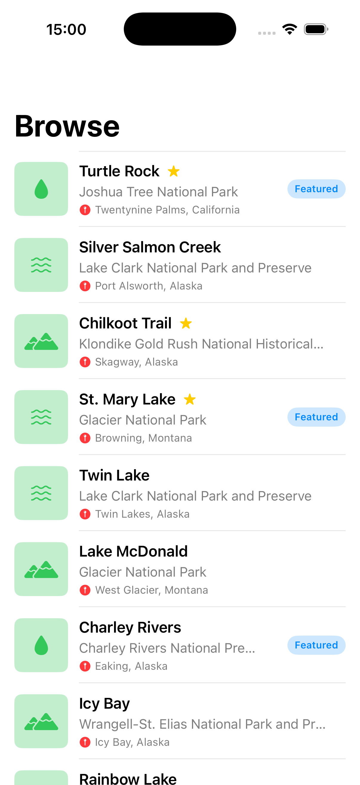

# BNZDemoTest

A SwiftUI demo application that displays a list of landmarks from various national parks across the United States.

## Features

- Fetches landmark data from a remote JSON API
- Displays landmarks in a clean, organized list view
- Shows landmark details including name, park, location, and category
- Visual indicators for featured and favorite landmarks
- Category-based icons (Lakes, Rivers, Mountains)
- Loading and error state handling with retry functionality

## Screenshot

<p align="center">
  
</p>

## Requirements

- iOS 17.0+
- Xcode 15.0+
- Swift 5.9+

## Architecture

The project follows the MVVM (Model-View-ViewModel) pattern:

```
BNZDemoTest/
├── Models/
│   └── LandMark.swift          # Data model
├── Views/
│   ├── ContentView.swift       # Root view
│   ├── LandMarkList.swift      # Main list view
│   └── LandMarkRow.swift       # List row component
├── ViewModels/
│   └── LandMarkViewModel.swift # Business logic & state management
├── Services/
│   ├── LandMarkService.swift   # Service protocol
│   └── DefaultLandMarkService.swift # API implementation
├── Utilities/
│   └── APIError.swift          # Error handling
└── BNZDemoTestApp.swift        # App entry point
```

## Data Source

Landmark data is fetched from:
```
https://raw.githubusercontent.com/ThrownToys/landmarkdata/refs/heads/main/landmarkData.json
```

## Usage

1. Clone the repository
2. Open `BNZDemoTest.xcodeproj` in Xcode
3. Build and run on simulator or device

## State Management

The app uses Swift's `@Observable` macro for reactive state management with three states:

- **Idle**: Initial state before data fetch
- **Loading**: Data is being fetched
- **Loaded**: Data successfully loaded and displayed
- **Error**: Failed to load data with retry option

## TODO

- [ ] Add unit tests using Swift Testing framework
- [ ] Add UI tests
- [ ] Implement landmark detail view
- [ ] Add search functionality
- [ ] Add filtering by category
- [ ] Implement favorites persistence
- [ ] Add map view integration

## License

This project is for demonstration purposes.
